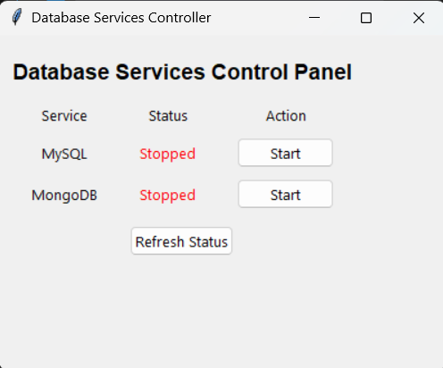

# DB Maestro 🎮

> Take control of your database services with a single click! A sleek, lightweight GUI application to manage MySQL and MongoDB services on Windows.

## 🚀 Features

-   **One-Click Control**: Start and stop MySQL and MongoDB services instantly
-   **Real-Time Monitoring**: Live status updates with visual indicators
-   **User-Friendly Interface**: Clean, intuitive GUI with color-coded status indicators
-   **Resource Efficient**: Minimal memory footprint when running in background
-   **Administrator Ready**: Built-in administrative privileges handling
-   **Auto-Refresh**: Automatic status updates every second

## 📸 Screenshot

## ⚡ Quick Start

1. Download the latest release from the [Releases](https://github.com/dudenies/DB_Maestro/releases) page
2. Run the executable (`DB_Maestro.exe`)
3. That's it! No installation needed

## 🔧 System Requirements

-   Windows 10/11
-   MySQL and/or MongoDB installed as Windows services
-   Administrative privileges

## 🎯 Default Service Names

The application looks for these default service names:

-   MySQL: `MySQL80`
-   MongoDB: `MongoDB`

## 💡 Pro Tips

1. **Add to Startup**:

    - Press `Win + R`
    - Type `shell:startup`
    - Drop a shortcut to DB Maestro here

2. **Quick Access**:
    - Press `Win + R`
    - Type `shell:programs`
    - Drop a shortcut for Start Menu access

## 🤝 Contributing

Contributions are welcome! Feel free to:

-   Report bugs
-   Suggest features
-   Submit pull requests

## 📝 License

This project is licensed under the MIT License - see the [LICENSE](LICENSE) file for details.

## 🙋‍♂️ Support

Having issues? Check out these common solutions:

1. **Service names don't match?**

    - Check your actual service names in Windows Services
    - Update the source code accordingly

2. **Access Denied?**
    - Make sure to run as administrator
    - Check if services are installed correctly

Still need help? [Open an issue](https://github.com/dudenies/DB_Maestro/issues)!

## 🌟 Why DB Maestro?

-   **Save Time**: No more navigating through Windows Services
-   **Resource Management**: Easily stop services when not in use
-   **Professional Setup**: Perfect for developers running local databases
-   **Peace of Mind**: Clear visual indicators of service status

Made with ❤️ by Dex
